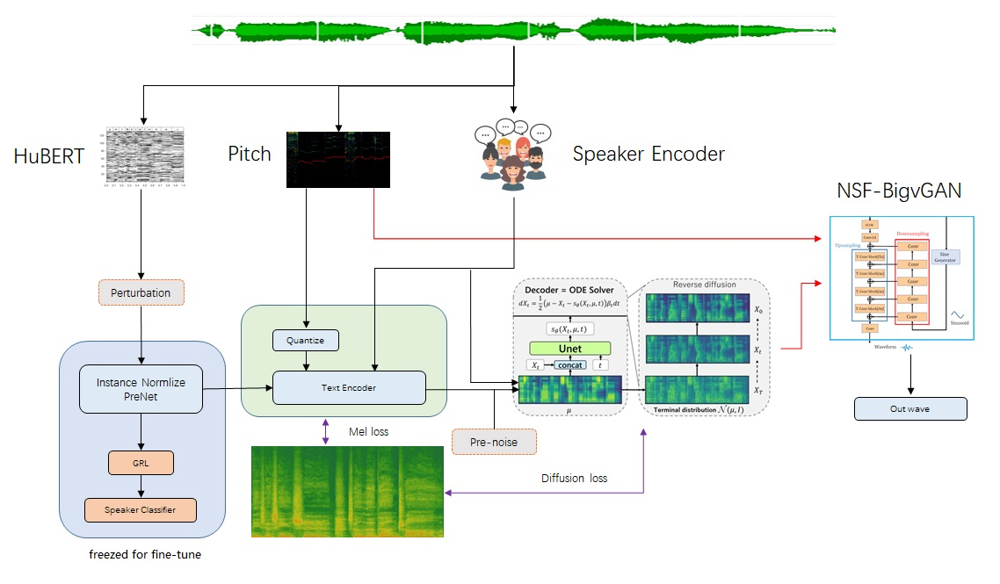
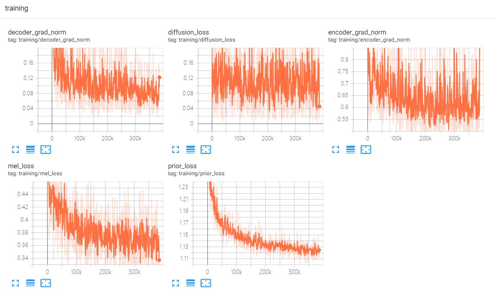

<div align="center">
<h1> Grad-SVC based on Grad-TTS from HUAWEI Noah's Ark Lab </h1>

This project is named as [Grad-SVC](), or [GVC]() for short. Its core technology is diffusion, but so different from other diffusion based SVC models. Codes are adapted from `Grad-TTS` and `so-vits-svc-5.0`. So the features from `so-vits-svc-5.0` are used in this project. By the way, [Diff-VC](https://github.com/huawei-noah/Speech-Backbones/tree/main/DiffVC) is a follow-up of [Grad-TTS](), [Diffusion-Based Any-to-Any Voice Conversion](https://arxiv.org/abs/2109.13821)

[Grad-TTS: A Diffusion Probabilistic Model for Text-to-Speech](https://arxiv.org/abs/2105.06337)


The framework of grad-svc-v1



The framework of grad-svc-v2 & grad-svc-v3 (conditional flow matching)

https://github.com/PlayVoice/Grad-SVC/assets/16432329/f9b66af7-b5b5-4efb-b73d-adb0dc84a0ae

</div>

## Features
1. Such beautiful codes from Grad-TTS

    `easy to read`

2. Multi-speaker based on speaker encoder

3. No speaker leaky based on `Perturbation` & `Instance Normlize` & `GRL`

4. No electronic sound

5. Integrated [DPM Solver-k](https://github.com/LuChengTHU/dpm-solver) for less steps (V2)

6. Integrated [Fast Maximum Likelihood Sampling Scheme](https://github.com/huawei-noah/Speech-Backbones/tree/main/DiffVC) (V2)

7. [Conditional Flow Matching](https://voicebox.metademolab.com/) (V3), first used in SVC

8. Low GPU memery required for train

    `V2: 6.2GB for batch_size=8, 64 dim`

    `V3: 7.3GB for batch_size=8, 96 dim`

## Setup Environment
1. Install project dependencies

    ```shell
    pip install -r requirements.txt
    ```

2. Download the Timbre Encoder: [Speaker-Encoder by @mueller91](https://drive.google.com/drive/folders/15oeBYf6Qn1edONkVLXe82MzdIi3O_9m3), put `best_model.pth.tar`  into `speaker_pretrain/`.

3. Download [hubert_soft model](https://github.com/bshall/hubert/releases/tag/v0.1)，put `hubert-soft-0d54a1f4.pt` into `hubert_pretrain/`.

4. Download pretrained [nsf_bigvgan_pretrain_32K.pth](https://github.com/PlayVoice/NSF-BigVGAN/releases/augment), and put it into `bigvgan_pretrain/`.

	**Performance Bottleneck: Generator and Discriminator are 116Mb, but Generator is only 22Mb**

	**系统性能瓶颈：生成器和判别器一共116M，而生成器只有22M**

5. Download pretrain model [gvc.pretrain.pth](https://github.com/PlayVoice/Grad-SVC/releases/tag/20230930), and put it into `grad_pretrain/`.
    ```
    python gvc_inference.py --model ./grad_pretrain/gvc.pretrain.pth --spk ./configs/singers/singer0001.npy --wave test.wav
    ```
    
    For this pretrain model, `temperature` is set `temperature=1.015` in `gvc_inference.py` to get good result.

## Dataset preparation
Put the dataset into the `data_raw` directory following the structure below.
```
data_raw
├───speaker0
│   ├───000001.wav
│   ├───...
│   └───000xxx.wav
└───speaker1
    ├───000001.wav
    ├───...
    └───000xxx.wav
```

## Data preprocessing
After preprocessing you will get an output with following structure.
```
data_gvc/
└── waves-16k
│    └── speaker0
│    │      ├── 000001.wav
│    │      └── 000xxx.wav
│    └── speaker1
│           ├── 000001.wav
│           └── 000xxx.wav
└── waves-32k
│    └── speaker0
│    │      ├── 000001.wav
│    │      └── 000xxx.wav
│    └── speaker1
│           ├── 000001.wav
│           └── 000xxx.wav
└── mel
│    └── speaker0
│    │      ├── 000001.mel.pt
│    │      └── 000xxx.mel.pt
│    └── speaker1
│           ├── 000001.mel.pt
│           └── 000xxx.mel.pt
└── pitch
│    └── speaker0
│    │      ├── 000001.pit.npy
│    │      └── 000xxx.pit.npy
│    └── speaker1
│           ├── 000001.pit.npy
│           └── 000xxx.pit.npy
└── hubert
│    └── speaker0
│    │      ├── 000001.vec.npy
│    │      └── 000xxx.vec.npy
│    └── speaker1
│           ├── 000001.vec.npy
│           └── 000xxx.vec.npy
└── speaker
│    └── speaker0
│    │      ├── 000001.spk.npy
│    │      └── 000xxx.spk.npy
│    └── speaker1
│           ├── 000001.spk.npy
│           └── 000xxx.spk.npy
└── singer
    ├── speaker0.spk.npy
    └── speaker1.spk.npy
```

1.  Re-sampling
    - Generate audio with a sampling rate of 16000Hz in `./data_gvc/waves-16k` 
    ```
    python prepare/preprocess_a.py -w ./data_raw -o ./data_gvc/waves-16k -s 16000
    ```
    - Generate audio with a sampling rate of 32000Hz in `./data_gvc/waves-32k`
    ```
    python prepare/preprocess_a.py -w ./data_raw -o ./data_gvc/waves-32k -s 32000
    ```
2. Use 16K audio to extract pitch
    ```
    python prepare/preprocess_f0.py -w data_gvc/waves-16k/ -p data_gvc/pitch
    ```
3. use 32k audio to extract mel
    ```
    python prepare/preprocess_spec.py -w data_gvc/waves-32k/ -s data_gvc/mel
    ``` 
4. Use 16K audio to extract hubert
    ```
    python prepare/preprocess_hubert.py -w data_gvc/waves-16k/ -v data_gvc/hubert
    ```
5. Use 16k audio to extract timbre code
    ```
    python prepare/preprocess_speaker.py data_gvc/waves-16k/ data_gvc/speaker
    ```
6. Extract the average value of the timbre code for inference
    ```
    python prepare/preprocess_speaker_ave.py data_gvc/speaker/ data_gvc/singer
    ``` 
8. Use 32k audio to generate training index
    ```
    python prepare/preprocess_train.py
    ```
9. Training file debugging
    ```
    python prepare/preprocess_zzz.py
    ```

## Train
1. Start training
   ```
   python gvc_trainer.py
   ``` 
2. Resume training
   ```
   python gvc_trainer.py -p logs/grad_svc/grad_svc_***.pth
   ```
3. Log visualization
   ```
   tensorboard --logdir logs/
   ```

## Train Loss




## Inference

1. Export inference model
   ```
   python gvc_export.py --checkpoint_path logs/grad_svc/grad_svc_***.pth
   ```

2. Inference
    ```
    python gvc_inference.py --model gvc.pth --spk ./data_gvc/singer/your_singer.spk.npy --wave test.wav --rature 1.015 --shift 0
    ```
    temperature=1.015, needs to be adjusted to get good results; Recommended range is (1.001, 1.035).

2. Inference step by step
    - Extract hubert content vector
        ```
        python hubert/inference.py -w test.wav -v test.vec.npy
        ```
    - Extract pitch to the csv text format
        ```
        python pitch/inference.py -w test.wav -p test.csv
        ```
    - Convert hubert & pitch to wave
        ```
        python gvc_inference.py --model gvc.pth --spk ./data_gvc/singer/your_singer.spk.npy --wave test.wav --vec test.vec.npy --pit test.csv --shift 0
        ```

## Data

| Name | URL |
| :--- | :--- |
|PopCS          |https://github.com/MoonInTheRiver/DiffSinger/blob/master/resources/apply_form.md|
|opencpop       |https://wenet.org.cn/opencpop/download/|
|Multi-Singer   |https://github.com/Multi-Singer/Multi-Singer.github.io|
|M4Singer       |https://github.com/M4Singer/M4Singer/blob/master/apply_form.md|
|VCTK           |https://datashare.ed.ac.uk/handle/10283/2651|

## Code sources and references

https://github.com/huawei-noah/Speech-Backbones/blob/main/Grad-TTS

https://github.com/huawei-noah/Speech-Backbones/tree/main/DiffVC

https://github.com/facebookresearch/speech-resynthesis

https://github.com/shivammehta25/Matcha-TTS

https://github.com/shivammehta25/Diff-TTSG

https://github.com/LuChengTHU/dpm-solver

https://github.com/gmltmd789/UnitSpeech

https://github.com/zhenye234/CoMoSpeech

https://github.com/seahore/PPG-GradVC

https://github.com/thuhcsi/LightGrad

https://github.com/lmnt-com/wavegrad

https://github.com/naver-ai/facetts

https://github.com/jaywalnut310/vits

https://github.com/NVIDIA/BigVGAN

https://github.com/bshall/soft-vc

https://github.com/mozilla/TTS

https://github.com/ubisoft/ubisoft-laforge-daft-exprt

##

https://github.com/yl4579/StyleTTS-VC

https://github.com/MingjieChen/DYGANVC

https://github.com/sony/ai-research-code/tree/master/nvcnet
